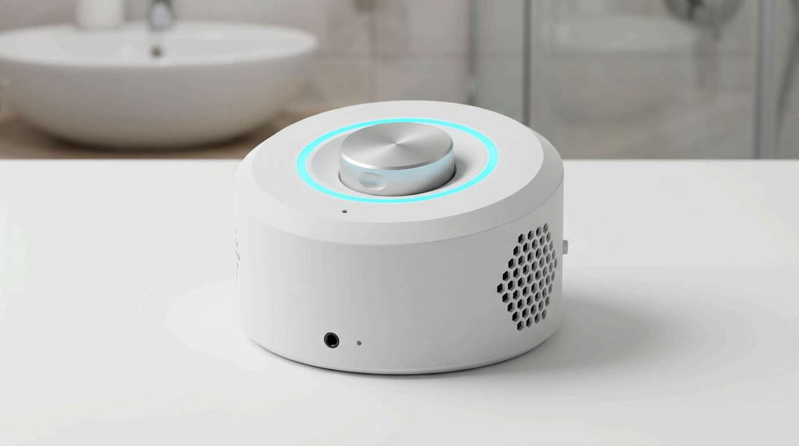
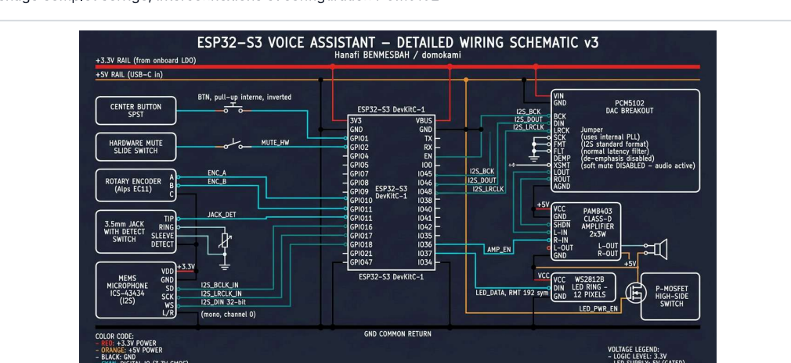
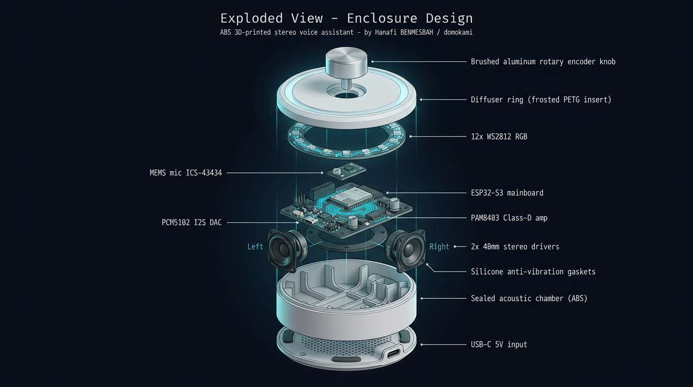

# S3 Salle de Bain

> Assistant vocal embarque ESP32-S3, prive et fonctionnant en local, dans un boitier imprime 3D dessine pour la salle de bain.

[](https://esphome.io)
[](https://www.home-assistant.io/voice_control/)
[](LICENSE)
[](LICENSE-DOCS)



---

## Sommaire

- [Apercu](#apercu)
- [Caracteristiques](#caracteristiques)
- [Materiel](#materiel)
- [Installation](#installation)
- [Configuration](#configuration)
- [Boitier 3D](#boitier-3d)
- [Documentation](#documentation)
- [Licence](#licence)

---

## Apercu

`s3-salle-de-bain` est un assistant vocal autonome installe dans la salle de bain integrant :

- Reconnaissance vocale locale via [microWakeWord](https://github.com/kahrendt/microWakeWord) (3 modeles + stop)
- Lecteur media multi-pipeline avec mixer 2 canaux, resampler par flux et ducking automatique -20 dB
- Anneau lumineux expressif de 12 LEDs WS2812 avec 17 effets `addressable_lambda` et 14 animations contextuelles
- Interactions physiques : bouton multi-clics (1/2/3 + Morse H-A), encodeur rotatif bi-fonction (volume / teinte HSV), jack 3.5 mm avec detection, switch mute hardware
- Aucun envoi de flux audio a des services tiers par defaut : tout est traite localement



---

## Caracteristiques

| | |
|---|---|
| **SoC** | ESP32-S3 DevKitC-1, 240 MHz, 16 MB Flash, PSRAM octal 80 MHz |
| **Audio** | DAC PCM5102 stereo 48 kHz / 16-bit, ampli PAM8403, 2 HP 40 mm / 4 ohms / 3 W |
| **Microphone** | MEMS I2S 32-bit mono, gain x4, VAD integre |
| **LEDs** | Anneau 12 x WS2812 GRB, refresh 15 ms, alimentation gatee via GPIO9 |
| **Reseau** | WiFi 2.4 GHz, IP statique, API ESPHome Noise Protocol, OTA chiffree |
| **Reponse audio** | 180 Hz - 18 kHz (+/- 4 dB), SPL max ~82 dB a 50 cm |
| **Boitier** | Galet cylindrique ABS blanc mat, 110 mm x 55 mm, anneau diffuseur PETG |

---

## Materiel

| Composant | Reference | Quantite |
|---|---|---|
| MCU | ESP32-S3-DevKitC-1 (N16R8) | 1 |
| DAC I2S | PCM5102 breakout | 1 |
| Amplificateur | PAM8403 Class-D | 1 |
| Microphone | INMP441 ou ICS-43434 (I2S MEMS) | 1 |
| Anneau LED | 12 x WS2812 (diametre ~50 mm) | 1 |
| Encodeur | Encodeur rotatif Alps EC11 + bouton-poussoir | 1 |
| Haut-parleurs | Pleine-bande 40 mm / 4 ohms / 3 W | 2 |
| Jack | Connecteur jack 3.5 mm chassis avec contact de detection | 1 |
| Switch mute | Interrupteur a glissiere lateral | 1 |
| MOSFET | P-MOSFET high-side (ou PNP) pour le power-gate LED | 1 |
| Inserts | Inserts filetes M3 thermofondus | 3 |

Voir [docs/Rapport Technique v3.pdf](docs/) sections 02 (schema) et 11 (BOM mecanique) pour les details.

### Brochage

| GPIO | Role |
|---|---|
| `GPIO1` | Bouton central (pull-up interne, inverted) |
| `GPIO2` | Switch mute hardware |
| `GPIO4 / 5 / 11` | Microphone MEMS I2S (LRCLK / BCLK / DIN) |
| `GPIO7 / 8 / 10` | DAC PCM5102 (LRCK / BCK / DIN) |
| `GPIO9` | Power gate LEDs (P-MOSFET) |
| `GPIO16 / 18` | Encodeur rotatif Pin A / Pin B |
| `GPIO17` | Detection jack 3.5 mm |
| `GPIO21` | Donnees WS2812 (RMT) |
| `GPIO47` | Enable amplificateur (PAM8403 SHDN) |

---

## Installation

### Prerequis

- Python 3.10+
- [ESPHome](https://esphome.io) 2025.9.3 ou superieur : `pip install esphome`
- Home Assistant 2025+ avec le composant Voice Assistant Pipeline

### Etapes

1. Cloner le repo :
   ```bash
   git clone https://github.com/hanafi09/s3-salle-de-bain.git
   cd s3-salle-de-bain
   ```

2. Copier le template de secrets :
   ```bash
   cp secrets.example.yaml secrets.yaml
   ```

3. Editer `secrets.yaml` avec tes credentials (WiFi, cle API, OTA password).
   Generer une nouvelle cle API :
   ```bash
   python -c "import secrets, base64; print(base64.b64encode(secrets.token_bytes(32)).decode())"
   ```

4. Compiler et flasher (USB-C) :
   ```bash
   esphome run s3-salle-de-bain.yaml
   ```

5. Apres le premier flash, les mises a jour suivantes peuvent se faire en OTA :
   ```bash
   esphome upload s3-salle-de-bain.yaml --device s3-salle-de-bain.local
   ```

---

## Configuration

### Niveaux de sensibilite wake word

L'entite `select.wake_word_sensitivity` expose 3 niveaux :

| Niveau | okay_nabu | hey_jarvis | hey_mycroft | FAPH* |
|---|---|---|---|---|
| Slightly sensitive | 0.85 | 0.97 | 0.99 | 0.000 (defaut) |
| Moderately sensitive | 0.69 | 0.92 | 0.95 | 0.376 - 1.502 |
| Very sensitive | 0.56 | 0.83 | 0.93 | 0.751 - 1.878 |

*FAPH = False Accepts Per Hour mesure sur le Dinner Party Corpus.

### Entites exposees a Home Assistant

| Type | Entite |
|---|---|
| `switch` | `mute`, `wake_sound` |
| `light` | `led_ring` |
| `media_player` | `external_media_player` |
| `select` | `wake_word_sensitivity` |
| `event` | `button_press` (double / triple / long / easter_egg) |
| `button` | `restart`, `factory_reset` |

### Sons embarques

16 sons via `media_player.files` (11 via substitutions YAML overridables, 5 hardcodes pour les factory reset / easter egg / cloud-auth-failed). Voir section 06 du rapport pour le tableau complet.

---

## Boitier 3D



Les 5 pieces du boitier sont fournies en sources parametriques OpenSCAD et apercus STL :

| Piece | Fichier source | Apercu |
|---|---|---|
| Capot superieur | [`housing_top.scad`](cad/housing_top.scad) | [`housing_top.stl`](cad/housing_top.stl) |
| Corps cylindrique | [`housing_body.scad`](cad/housing_body.scad) | [`housing_body.stl`](cad/housing_body.stl) |
| Fond | [`housing_bottom.scad`](cad/housing_bottom.scad) | [`housing_bottom.stl`](cad/housing_bottom.stl) |
| Baffle stereo | [`speaker_baffle.scad`](cad/speaker_baffle.scad) | [`speaker_baffle.stl`](cad/speaker_baffle.stl) |
| Anneau diffuseur | [`diffuser_ring.scad`](cad/diffuser_ring.scad) | [`diffuser_ring.stl`](cad/diffuser_ring.stl) |

Parametres d'impression recommandes : voir [`cad/README.txt`](cad/README.txt). En resume : ABS blanc mat, couche 0.16 mm, 4 perimetres, remplissage gyroid 25 %, ~9 h d'impression.

---

## Documentation

Le rapport technique complet (24 pages, 12 sections) est disponible :

- [PDF](docs/S3%20Salle%20de%20Bain%20-%20Rapport%20Technique%20v3.pdf) - mise en page pro, hyperliens cliquables vers les sons GitHub et fichiers CAO
- [DOCX](docs/S3%20Salle%20de%20Bain%20-%20Rapport%20Technique%20v3.docx) - editable, styles Word natifs

**Sommaire :**

1. Presentation du projet
2. Schema de cablage
3. Tableau de brochage ESP32-S3
4. Configuration des modules (PCM5102, MEMS, WS2812, alimentation)
5. Pipeline audio
6. Sons embarques (catalogue media_player.files)
7. Stack logiciel (variables globales, scripts, on_boot, timer_ringing)
8. Retour visuel (14 animations + 17 effets LED nommes)
9. Reseau et securite
10. Boitier imprime 3D
11. Vue eclatee et nomenclature (BOM + fichiers CAO)
12. Annexe YAML (extraits cles de s3-salle-de-bain.yaml)

---

## Licence

- **Firmware** (s3-salle-de-bain.yaml) et **materiel** (cad/) : [CERN-OHL-S-2.0](LICENSE)
- **Documentation** (docs/, README, images) : [CC-BY-SA-4.0](LICENSE-DOCS)

Si vous remixez ce projet, vous devez le distribuer sous les memes licences.

---

## Credits

- Auteur : **Hanafi BENMESBAH** ([@hanafi09](https://github.com/hanafi09)) / domokami
- Bibliotheques amont :
  - [ESPHome](https://esphome.io)
  - [microWakeWord](https://github.com/kahrendt/microWakeWord) (Kevin Ahrendt)
  - [Home Assistant Voice PE](https://github.com/esphome/home-assistant-voice-pe) (assets sonores)
- Inspiration boitier : tradition Dieter Rams / Braun
