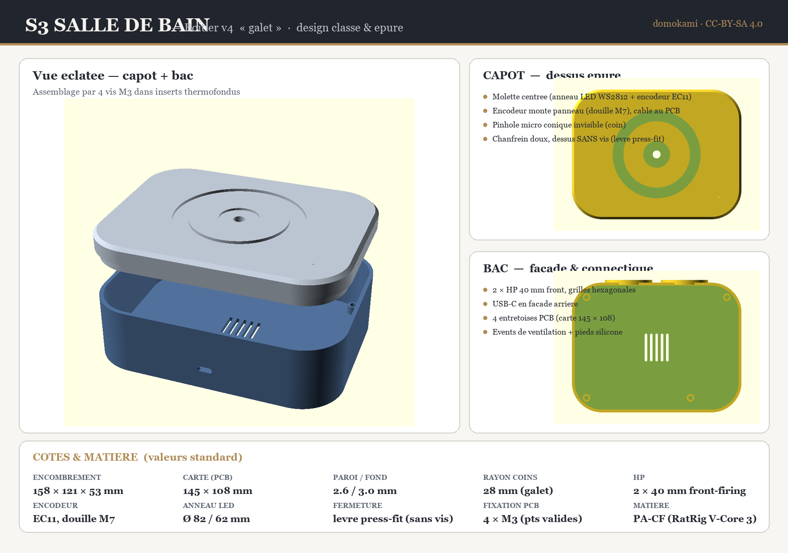

# Boîtier v4 — « galet rectangulaire arrondi »

Boîtier **conçu pour la carte porteuse KiCad 145 × 108 mm** de ce dépôt
(remplace l'ancien boîtier cylindrique Ø110 mm, désormais en *legacy* dans
`cad/`). Design *classe & épuré* : galet à coins arrondis, molette centrée,
haut-parleurs en façade, **dessus sans vis**.

## Pièces

| Fichier | Rôle | Matière conseillée |
|---|---|---|
| `v4_base.stl` / `.step` | Bac (parois, façade HP, USB-C, entretoises PCB) | PA-CF |
| `v4_top.stl` / `.step` | Capot (molette, anneau LED, micro, lèvre) | PA-CF |
| `v4_speaker_gasket.stl` / `.step` | 2 joints d'enceinte (compression) | TPU 95A |

Les `.scad` sont paramétriques : tout est piloté par **`params.scad`**.

### Fichiers STEP (CAO / partage fabricant)

OpenSCAD **n'exporte pas le STEP** (géométrie maillée, pas de B-rep). Les `.step`
fournis sont des **solides B-rep facettés** reconstruits depuis les STL via
FreeCAD (`stl_to_step.py`). Ils sont valides et fermés (un solide chacun, sauf
le joint = 2 solides), donc importables dans tout MCAD ou chez un fabricant.

> ⚠️ `v4_base.step` est volumineux (~22 Mo) : les grilles hexagonales génèrent
> ~23 000 faces planes. `v4_top.step` (~3 Mo) et `v4_speaker_gasket.step`
> (~2,4 Mo) sont légers. Pour ré-générer : `freecadcmd stl_to_step.py`.
> Pour de l'édition paramétrique, **privilégier les `.scad`**.
`v4_assembly.scad` (éclaté) et `v4_section.scad` (coupe) sont des vues de
contrôle, pas des pièces à imprimer.

## Caractéristiques

- **Encombrement** : 158 × 121 × 53 mm — **carte** : 145 × 108 mm
- **Paroi / fond** : 2,6 / 3,0 mm · **rayon des coins** : 28 mm
- **Haut-parleurs** : 2 × 40 mm *front-firing*, grilles hexagonales + anneaux M2.5
- **Encodeur** : EC11 **monté sur le capot** (douille M7), relié par fil aux
  connecteurs `SW1` / `DS1` de la carte. *(Un EC11 soudé sur le PCB ne pourrait
  pas atteindre le dessus situé ~50 mm plus haut.)*
- **Anneau LED** WS2812 : Ø 82 / 62 mm, gorge diffuseur
- **Micro** : pinhole conique Ø 0,8 mm (invisible, rejeté dans un coin)
- **Fermeture** : lèvre périphérique en **press-fit** (jeu 0,15 mm), aucune vis
  visible + encoche de démontage à l'arrière
- **Fixation PCB** : 4 × M3 sur entretoises, aux 4 points **validés sans
  collision** sur la carte (cf. `kicad/find_mount_points.py`) :
  PCB (7, 7) · (138, 44) · (104, 101) · (7, 101)

## Impression (RatRig V-Core 3 400, buse 0,4)

PA-CF, couche 0,2 mm, 4 périmètres, 5 couches dessus / dessous, remplissage
25 % gyroïde, **sans support** (lèvre et grilles auto-portées), bord (brim)
auto 8 mm. Buse 290 °C, plateau 100 °C, ventilation 10–30 %.

> Le projet OrcaSlicer prêt à trancher est fourni dans
> `cad/boitier_v4/boitier_v4.3mf` (mêmes réglages PA-CF que `boitier_base_optimise`).
