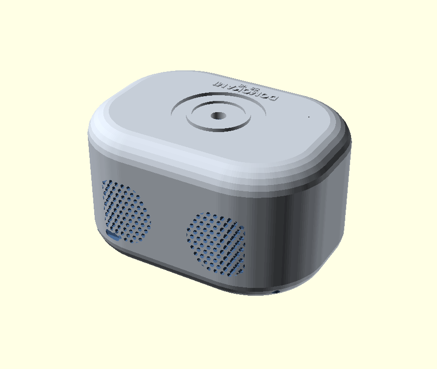

# Boîtier v5 — « galet intégral » (4 HP + basses)

Évolution majeure de la v4 : **forme galet très arrondie** (toutes les arêtes
adoucies) et **4 haut-parleurs** dont 2 radiateurs passifs pour le renfort de
basses. Conçu pour la carte porteuse **76,7 × 108 mm** (export JLCPCB).

## Pièces

| Fichier | Rôle | Matière |
|---|---|---|
| `v5_base.stl` / `.step` | Bac (galet, façade + arrière HP, USB-C, entretoises) | PA-CF |
| `v5_top.stl` / `.step` | Capot (molette, anneau LED, micro, marquage relief) | PA-CF |
| `v5_speaker_gasket.stl` / `.step` | 4 joints d'enceinte (étanchéité basses) | TPU 95A |

Paramétrique : tout est piloté par **`params.scad`**.

## Acoustique — 4 HP

- **2 plein-bande 40 mm en façade** (+Y), actifs, reliés au PAM8403.
- **2 radiateurs passifs à l'arrière** (-Y) pour la **réflexion de basse** :
  aucun câblage, ils résonnent par la pression interne → **PCB inchangé**.
- **Caisson étanche** : pas d'events ; prévoir les **4 joints TPU** (compression)
  pour une vraie restitution des basses.

## Caractéristiques

- **Encombrement** : 121 × 90 × 69 mm — **carte** : 76,7 × 108 mm
- **Galet** : arêtes arrondies (fillet 12 mm), coins R36, **toutes faces adoucies**
- **Paroi / fond** : 2,6 / 7,0 mm
- **HP** : 4 × 40 mm (2 actifs façade + 2 radiateurs passifs arrière), z = 31 mm
- **USB-C** : bas de la paroi arrière (aligné sur `J2`), sous les radiateurs
- **Encodeur** : EC11 monté sur le capot (douille M7), câblé au PCB
- **Anneau LED** WS2812 : Ø 44 / 30 mm
- **Micro** : pinhole Ø 0,8 mm au-dessus de l'INMP441
- **Marquage** : DOMOKAMI + S3 v5 **en relief** sur le capot (côté façade)
- **Fermeture** : lèvre press-fit (sans vis) + encoche de démontage latérale
- **Fixation PCB** : 4 × M3 sur entretoises, trous réels `MK1`–`MK4`
- **Montage HP** : par l'intérieur, 4 avant-trous M2.5 par HP (façade nette)

> Boîtier obtenu par rotation −90° de la carte (HP façade +Y / USB-C arrière −Y).
> Le STEP du bac utilise des ouvertures HP circulaires + `$fn` réduit (valide & léger).

## Impression (RatRig V-Core 3 400, buse 0,4)

PA-CF, couche 0,2 mm, 4 périmètres, 5 dessus/dessous, gyroïde 25 %, **sans
support**, buse 290 °C / plateau 100 °C. Projet OrcaSlicer prêt : `boitier_v5.3mf`.
Joints HP en **TPU 95A**. La v4 reste disponible dans `cad/boitier_v4/`.
