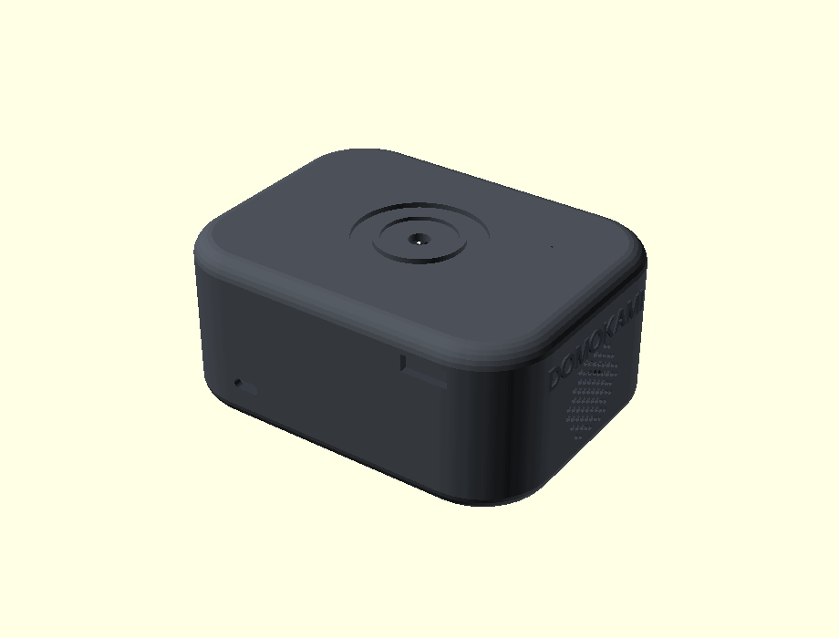
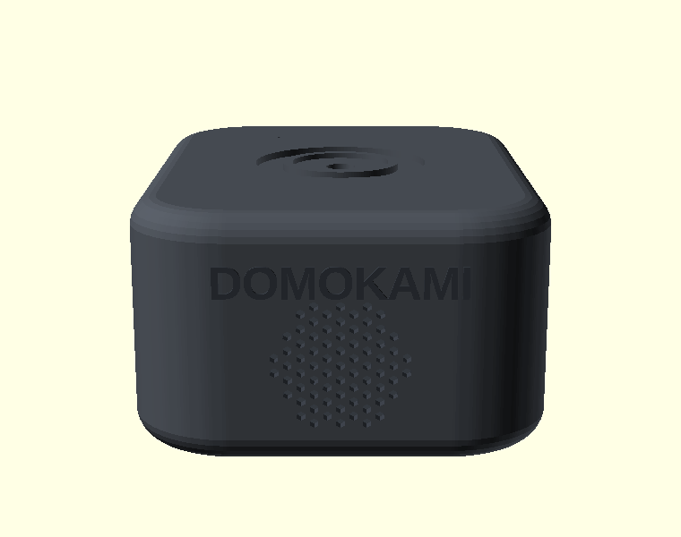

# Boîtier v6 — style **JBL** (plat & large)

Boîtier inspiré des enceintes portables JBL (Go / Clip) : **plat, large, épuré**,
avec les **radiateurs de basse aux extrémités** (logo DOMOKAMI), comme une vraie
JBL. Corrige le chevauchement USB-C / HP de la v5. Carte **76,7 × 108 mm**.

## Pièces

| Fichier | Rôle | Matière |
|---|---|---|
| `v6_base.stl` / `.step` | Bac (façade 2 HP, bouts 2 radiateurs, USB-C, entretoises) | PA-CF |
| `v6_top.stl` / `.step` | Capot (molette, anneau LED, micro) | PA-CF |
| `v6_speaker_gasket.stl` / `.step` | 4 joints d'enceinte | TPU 95A |

Paramétrique : tout est piloté par **`params.scad`**.

## Acoustique — 4 HP, style JBL
- **2 HP plein-bande actifs en façade** (+Y), 2 grilles rondes hexagonales.
- **2 radiateurs passifs sur les 2 bouts** (±X) pour la réflexion de basse ;
  **logo DOMOKAMI en relief** au-dessus de chaque radiateur (façon logo JBL).
- **USB-C seul à l'arrière** (-Y) → **plus aucun chevauchement** avec un HP.
- **Caisson étanche** + 4 joints TPU.

## Caractéristiques
- **Encombrement** : **129 × 98 × 58 mm** (plat & large) — carte 76,7 × 108
- **Coins** R24, **arêtes** adoucies (fillet 7 mm) — look JBL Go/Clip
- **Paroi / fond** : 2,6 / 5,0 mm
- **HP** : 4 × 40 mm (2 actifs façade + 2 radiateurs passifs bouts), z = 24 mm
- **Encodeur** EC11 sur le capot (douille M7) ; **anneau LED** Ø44/30
- **Micro** pinhole au-dessus de l'INMP441 ; **fixation PCB** 4 × M3 (MK1–MK4)
- **Montage HP** par l'intérieur (façade nette, sans cercle)
- **Fermeture** lèvre press-fit (sans vis) + encoche de démontage

## Impression (RatRig V-Core 3 400, buse 0,4)
PA-CF, couche 0,2 mm, 4 périmètres, 5 dessus/dessous, gyroïde 25 %, **sans
support**, buse 290 °C / plateau 100 °C. Projet OrcaSlicer : `boitier_v6.3mf`.
Joints HP en **TPU 95A**. v4 et v5 conservées dans `cad/`.
